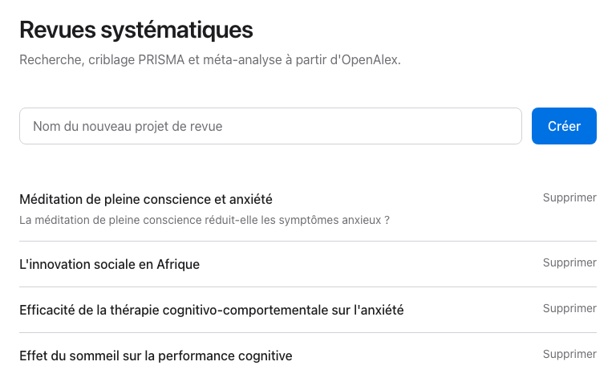
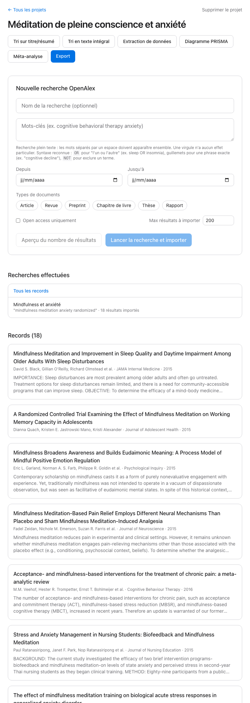
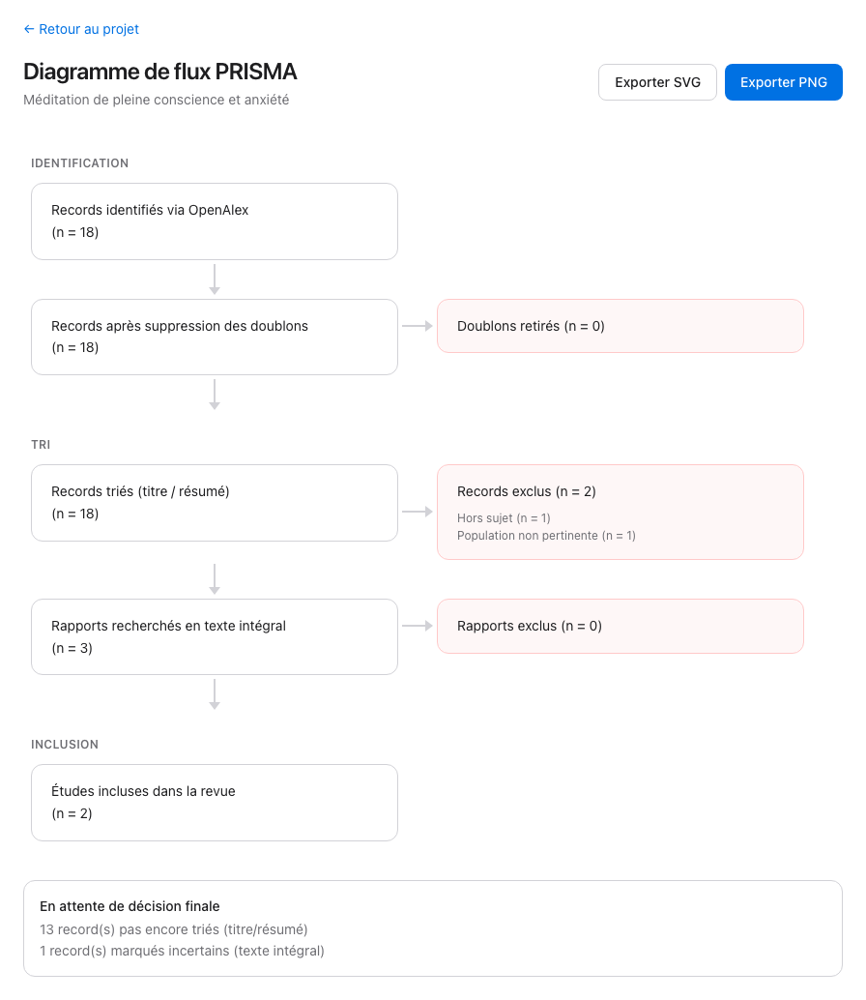
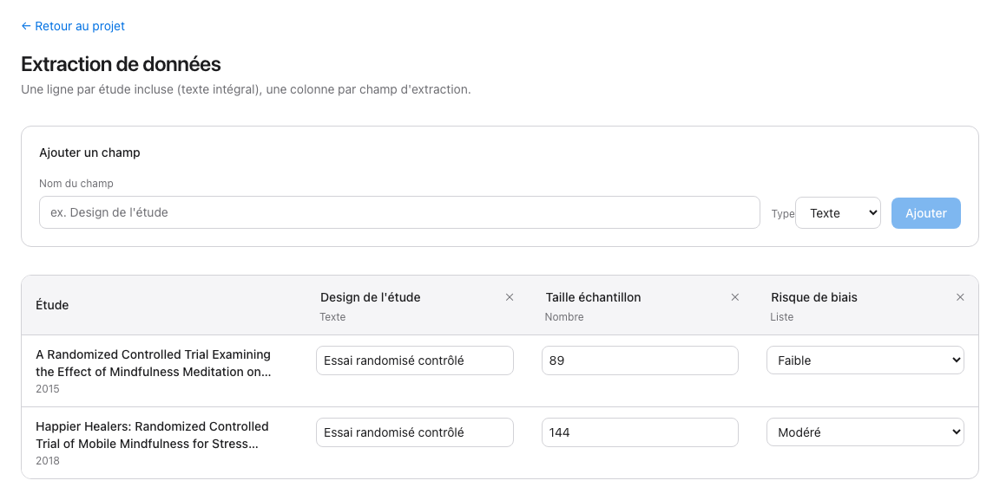
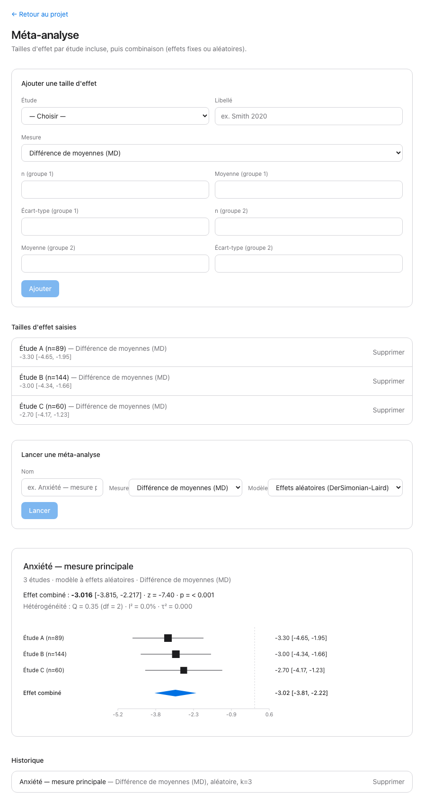
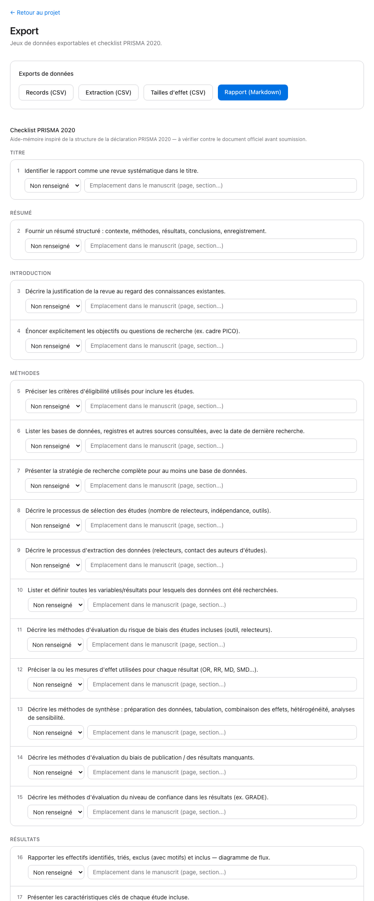

# User Guide

Manual for conducting a PRISMA systematic review and meta-analysis with the tool, from creating a project to the final export.

> **Note:** the application's interface is in French only (no language switch). This guide is in English, but every button/label is quoted with its exact French wording so you can match it on screen.

This guide assumes the app is already installed and running (see the [README](../README.md) for installation). Once both servers are started, the interface is available at [http://localhost:5173](http://localhost:5173).

## Contents

1. [Create a project](#1-create-a-project)
2. [Search OpenAlex](#2-search-openalex)
3. [Title/abstract screening](#3-titleabstract-screening)
4. [Full-text screening](#4-full-text-screening)
5. [Read the PRISMA flow diagram](#5-read-the-prisma-flow-diagram)
6. [Extract data](#6-extract-data)
7. [Run the meta-analysis](#7-run-the-meta-analysis)
8. [Export results](#8-export-results)
9. [Delete a project](#9-delete-a-project)
10. [Common issues](#10-common-issues)

---

## 1. Create a project

On the home page, type a name into the **"Nom du nouveau projet de revue"** ("Name of the new review project") field and click **Créer** ("Create"). Each project is fully independent: its searches, screening decisions, extraction, and meta-analyses all belong to it alone.

Click a project's name in the list to open it.

## 2. Search OpenAlex

From the project page, in the **"Nouvelle recherche OpenAlex"** ("New OpenAlex search") section:

- **Nom de la recherche** ("Search name", optional) — for your own reference in the history. If left blank, the keywords are used as the name.
- **Mots-clés** ("Keywords") — a full-text search sent to OpenAlex as-is. Words separated by a space must appear together; a comma has no special effect. Useful syntax:
  - `OR` for "either" — `sleep OR insomnia`
  - quotes for an exact phrase — `"cognitive decline"`
  - `NOT` to exclude a term — `sleep NOT apnea`
- **Depuis / Jusqu'à** ("From / To") — filter by publication date.
- **Types de documents** ("Document types") — Article, Revue (Review), Preprint, Chapitre de livre (Book chapter), Thèse (Dissertation), Rapport (Report). No selection = all types.
- **Open access uniquement** ("Open access only") — restrict to open-access works.
- **Max résultats à importer** ("Max results to import") — import cap (up to 10,000).

Before running the import, click **"Aperçu du nombre de résultats"** ("Preview result count") to see how many works OpenAlex finds with these criteria, without importing anything. Refine your query if the number looks unreasonable.

Once satisfied, click **"Lancer la recherche et importer"** ("Run search and import"). The import runs **in the background**: the button responds immediately, and the search appears in the **"Recherches effectuées"** ("Searches performed") list with a *"import en cours…"* ("import in progress…") status, which updates automatically (every 2 seconds) until the import completes. You can keep navigating the app while it runs.

Duplicates (a work whose OpenAlex ID was already found by an earlier search) are never imported twice — they're simply linked to the new search as well.

Click a search in the list to filter the records shown below to the ones it found; click **"Tous les records"** ("All records") to go back to the full view.

## 3. Title/abstract screening

Click **"Tri sur titre/résumé"** ("Sort on title/abstract") from the project page.

The screen shows one card per record (title, authors, journal, year, abstract) with three possible decisions:

| Action | Keyboard shortcut | Button |
|---|---|---|
| Include | → | **Inclure** ("Include") |
| Exclude | ← (opens the reason picker) | **Exclure** ("Exclude") |
| Mark as uncertain | ↓ or **M** | **Peut-être** ("Maybe") |

Excluding a record asks for a reason: pick one of the suggested chips (Hors sujet / Off-topic, Mauvais design d'étude / Poor study design, Population non pertinente / Irrelevant population, Langue non prise en charge / Unsupported language, Doublon / Duplicate, Autre / Other) or type a custom one, then click **"Confirmer l'exclusion"** ("Confirm exclusion"). **Escape** cancels and returns to the card.

The progress bar at the top shows how many records have been screened out of the total, with the include/exclude/maybe breakdown.

**"Voir l'historique des décisions"** ("View decision history") lists every decision made, with an **Annuler** ("Undo") button per row to reverse a decision (the record goes back into the screening queue).

## 4. Full-text screening

Click **"Tri en texte intégral"** ("Sort in full text"). It works exactly like title/abstract screening, with two differences:

- Only records **included** at the title/abstract stage appear in this queue.
- An **"Ouvrir le texte intégral ↗"** ("Open full text ↗") link (to the DOI) is shown on each card so you can read the full article before deciding.

The badge at the top of the page (**1. Titre / résumé** — **2. Texte intégral**) lets you switch freely between the two stages; their progress is tracked independently.

## 5. Read the PRISMA flow diagram

Click **"Diagramme PRISMA"** ("PRISMA diagram"). The diagram is generated automatically from your screening decisions, following the standard PRISMA 2020 structure:

**Identification** → records identified via OpenAlex, duplicates removed → **Screening** → records screened and excluded (with reasons) at the title/abstract stage, then at the full-text stage → **Inclusion** → studies included in the review.

A separate box flags any records still marked uncertain or not yet screened — a category specific to this tool, not part of the official PRISMA diagram.

Use **"Exporter PNG"** or **"Exporter SVG"** ("Export PNG"/"Export SVG") to download an image of the diagram, for inclusion in your manuscript or supplementary materials.

## 6. Extract data

Click **"Extraction de données"** ("Data extraction"). This grid only covers studies **included at the full-text stage**.

Start by defining your extraction fields under **"Ajouter un champ"** ("Add a field"):
- **Texte** ("Text") — free-text field (e.g. study design)
- **Nombre** ("Number") — numeric field (e.g. sample size)
- **Oui/Non** ("Yes/No") — checkbox
- **Liste** ("List") — dropdown, with options separated by commas (e.g. `Faible, Modéré, Élevé` — Low, Moderate, High)

Each field then appears as a column in the grid, one row per included study. Values save automatically (on blur for text/number fields, immediately for checkboxes and dropdowns).

To rename a field, edit its name directly in the column header. To delete it, click the **✕** next to the name — a confirmation is required, since every value entered for that field will be lost.

## 7. Run the meta-analysis

Click **"Méta-analyse"** ("Meta-analysis"). This page has two parts: entering effect sizes, then running the pooled calculation.

### Enter an effect size

Choose the study (among included studies), a label, then the **measure**:

| Measure | Fields required |
|---|---|
| Mean difference (MD) | n, mean, SD for each group |
| Standardized mean difference / Hedges' g (SMD) | n, mean, SD for each group |
| Odds ratio (OR) | events and n for each group |
| Risk ratio (RR) | events and n for each group |
| Custom | effect size + standard error (SE) |

Click **"Ajouter"** ("Add"). The computed effect size (with its 95% confidence interval) appears in the **"Tailles d'effet saisies"** ("Effect sizes entered") list.

### Run the pooling

Give the analysis a name, choose the **measure** to combine (only measures with at least one effect size entered are offered) and the **model**:
- **Effets aléatoires (DerSimonian-Laird)** ("Random effects") — the default recommendation, suited when heterogeneity between studies is plausible.
- **Effets fixes** ("Fixed effects") — assumes every study is estimating the same true effect.

Click **"Lancer"** ("Run"). The result shows the pooled effect with its confidence interval, z, the p-value, then heterogeneity statistics (Q, degrees of freedom, I², τ²), and a **forest plot**: one row per study (box sized by its weight in the pooling), with a blue diamond at the bottom representing the pooled effect. For OR/RR the axis uses a logarithmic scale with a reference line at 1; for MD/SMD the reference is at 0.

The history keeps every previous run — click one to display it again, or **Supprimer** ("Delete") to remove it.

## 8. Export results

Click **"Export"**. Two sections:

**Exports de données** ("Data exports") — four direct downloads:
- **Records (CSV)** — every record in the project with its screening decisions.
- **Extraction (CSV)** — the extraction grid for included studies.
- **Tailles d'effet (CSV)** — every effect size entered.
- **Rapport (Markdown)** ("Report") — a document automatically assembling the research question, search method, PRISMA flow numbers, table of included studies, and meta-analysis results. A solid starting point for drafting the methods/results section of a manuscript.

**Checklist PRISMA 2020** — 27 items grouped by section (Title, Abstract, Introduction, Methods, Results, Discussion, Other information). For each item, record a status (Rapporté/Reported, Partiel/Partial, Non rapporté/Not reported, Non applicable/Not applicable) and where it's addressed in your manuscript (page, section). This is a worksheet aid inspired by the structure of the PRISMA 2020 statement — check it against [the official document](http://www.prisma-statement.org/) before any submission.

## 9. Delete a project

From the project list or a project's page, click **"Supprimer"** / **"Supprimer le projet"** ("Delete" / "Delete project"). A confirmation is required: deletion is **permanent** and removes all associated data (searches, records, screening decisions, extraction, effect sizes, meta-analyses, checklist).

## 10. Common issues

**"Échec de l'import OpenAlex. Vérifie ta requête et réessaie."** ("OpenAlex import failed. Check your query and try again.") — in the vast majority of cases this means the backend server isn't running. Check that both servers (backend on port 8000, frontend on port 5173) are up, then retry.

**A search stays stuck on "import en cours…"** ("import in progress…") — a rare case where the background import failed unexpectedly while handling its own error recovery. Start a new search with the same criteria.

**The preview result count looks huge** — the search is full-text, not a strict keyword match. Narrow it with quotes for an exact phrase, or tighten the date/document-type filters.
